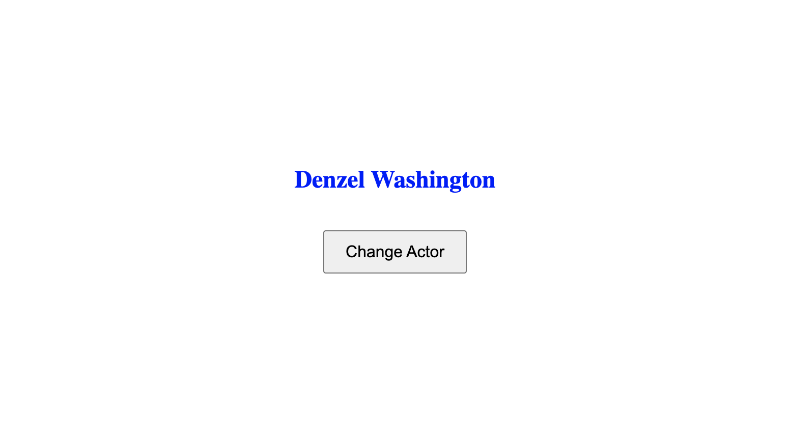

# Random Actor Generator Web App



## Table of Contents

- [About the Project](#about-the-project)
  - [Built With](##built-with)
- [Getting Started](#getting-started)
  - [Prerequisites](##prerequisites)
  - [Installation](##installation)
- [Usage](#usage)
- [Contributing](#contributing)
- [License](#license)
- [Acknowledgements](#acknowledgements)

## About the Project

The "Random Actor Generator Web App" is a simple yet engaging web application built with Flask, HTML, CSS, and JavaScript. It dynamically generates and displays a random actor's name along with a randomly chosen text color. Users can click a button to fetch a new actor's name and observe real-time changes to both the actor's name and text color, all without the need for a full page refresh.

### Built With

- [Flask](https://flask.palletsprojects.com/): A lightweight web framework for Python.
- HTML: The standard markup language for creating web pages.
- CSS: Used for styling the web page and centering content.
- JavaScript: Handles AJAX requests and dynamic updates.

## Getting Started

To get a local copy of this project up and running, follow these simple steps.

### Prerequisites

You need to have Python and pip (Python package manager) installed on your system.

### Installation

1. Clone the repo
   ```bash
   git clone https://github.com/tabebill/random-actor.git
   ```

# Navigate to the project directory
   ```bash
   cd random-actor
   ```

# Install Python dependencies
   ```bash
   pip install -r requirements.txt
   ```

# Start the Flask application
   ```bash
   python app.py
   ```

The web app should now be accessible at http://localhost:5001 in your web browser.

## Usage

Open your web browser and go to http://localhost:5001.

You'll see a randomly generated actor's name with a unique text color.

Click the "Change Actor" button to fetch a new actor's name and observe the dynamic changes in both the actor's name and text color.

Continue clicking the button to experience the real-time generation of random actors and colors.

## Contributing

Contributions are what make the open-source community such a fantastic place to learn, inspire, and create. Any contributions you make are greatly appreciated.

Fork the Project
Create your Feature Branch (git checkout -b feature/AmazingFeature)
Commit your Changes (git commit -m 'Add some AmazingFeature')
Push to the Branch (git push origin feature/AmazingFeature)
Open a Pull Request

## License

Distributed under the GNU License. See LICENSE for more information.

## Acknowledgements

This project was created to demonstrate the integration of Flask with frontend technologies.
Special thanks to the Flask, HTML, CSS, and JavaScript communities for their valuable resources and documentation.